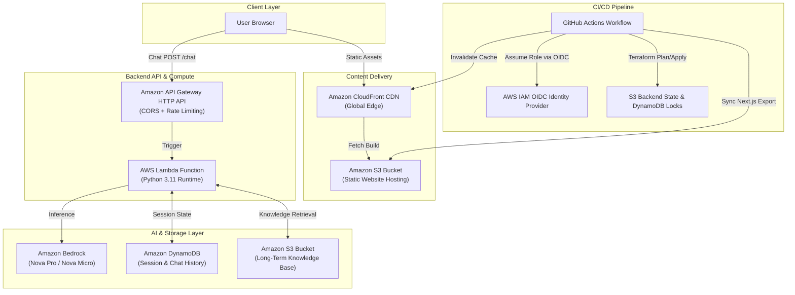

# Mohammed Huzaif's AI Digital Twin 🤖

[](https://d2r24io8s6cv01.cloudfront.net/)
[](https://nextjs.org/)
[](https://aws.amazon.com/bedrock/)
[](https://www.terraform.io/)
[](https://github.com/features/actions)

A full-stack, enterprise-grade **AI Digital Twin** representing Mohammed Huzaif. The twin answers questions, shares background and expertise, and converses with users in real-time. Built entirely on a **100% serverless AWS architecture**, provisioned with **Terraform**, and automated with a modern **GitHub Actions CI/CD pipeline using OIDC authentication**.

🔗 **Live Production Site:** [https://d2r24io8s6cv01.cloudfront.net/](https://d2r24io8s6cv01.cloudfront.net/)

---

## 🏗️ Architecture Overview

The application follows modern cloud and serverless design principles:



---

## ✨ Key Features

- **🧠 Advanced AI Foundation**:
  - **Production:** Powered by **Amazon Nova Pro** (`amazon.nova-pro-v1:0`) for complex, high-reasoning conversational intelligence.
  - **Development:** Powered by **Amazon Nova Micro** (`amazon.nova-micro-v1:0`) for ultra-low latency and cost-effective development cycles.
- **⚡ 100% Serverless & Pay-Per-Request**:
  - Zero idle cost — scales from 0 to thousands of concurrent users automatically.
  - AWS Lambda + API Gateway + DynamoDB on-demand mode.
- **🛡️ Secure, Keyless CI/CD (GitHub Actions + OIDC)**:
  - Uses AWS OpenID Connect (OIDC) with immutable subject claims.
  - **Zero permanent AWS access keys or secrets** stored in GitHub repository settings.
- **📦 Distributed Remote State Management**:
  - Multi-environment Terraform state stored in remote S3 bucket with client-side encryption.
  - Distributed state locking via DynamoDB to prevent concurrent deployment collisions.
- **🌐 High-Speed Edge Delivery**:
  - Next.js static export distributed across global AWS CloudFront edge locations.
  - Automated CloudFront cache invalidation on code deployment.
- **🔒 API Throttling & Protection**:
  - Configurable rate limits and burst protection via API Gateway (e.g., 50 burst / 25 rate limit in production).
  - Cross-Origin Resource Sharing (CORS) restricted to authorized origins.

---

## 📁 Repository Structure

```text
twin/
├── .github/
│   └── workflows/
│       ├── deploy.yml            # Automated CI/CD deployment pipeline
│       └── destroy.yml           # Safe manual teardown workflow
├── backend/
│   ├── lambda_handler.py         # Main AWS Lambda entry point & routing
│   ├── resources.py              # Bedrock, DynamoDB, and S3 integration
│   └── requirements.txt          # Python dependencies
├── frontend/
│   ├── app/                      # Next.js App Router (layout.tsx, page.tsx)
│   ├── components/               # UI components (twin.tsx chat interface)
│   ├── public/                   # Static assets (avatar.jpg, favicon.ico)
│   ├── package.json              # Frontend dependencies
│   └── next.config.ts            # Static HTML export configuration
├── terraform/
│   ├── main.tf                   # Core AWS infrastructure (S3, CloudFront, Lambda, API Gateway)
│   ├── variables.tf              # Configurable variables & defaults
│   ├── outputs.tf                # Deployed URLs and resource identifiers
│   ├── backend.tf                # S3 remote backend declaration
│   ├── backend-setup.tf          # Terraform state bucket & lock table setup
│   ├── github-oidc.tf            # GitHub Actions OIDC provider & IAM deployment role
│   ├── terraform.tfvars          # Default workspace variables
│   └── prod.tfvars               # Production-specific overrides (Nova Pro, limits)
├── scripts/
│   ├── deploy.sh / deploy.ps1    # Cross-platform local deployment scripts
│   └── destroy.sh / destroy.ps1  # Cross-platform infrastructure destruction scripts
└── README.md
```

---

## 🛠️ Tech Stack

| Component | Technology | Purpose |
| :--- | :--- | :--- |
| **Frontend** | Next.js 16, React 19, TypeScript | Modern chat interface with static export |
| **Styling** | Tailwind CSS, Lucide Icons | Clean, responsive UI with custom branding |
| **Backend** | Python 3.11, AWS Lambda | Lightweight serverless API execution |
| **LLM Inference** | AWS Bedrock (Amazon Nova) | Multimodal foundation models for digital persona |
| **Memory** | Amazon DynamoDB & Amazon S3 | Session chat history and document storage |
| **API** | Amazon API Gateway (HTTP API v2) | Low-latency HTTP routing with CORS & throttling |
| **CDN & Storage** | Amazon CloudFront & Amazon S3 | Global static asset caching and website hosting |
| **IaC** | Terraform (HashiCorp) | Declarative multi-environment infrastructure |
| **CI/CD** | GitHub Actions | Automated build, test, and zero-downtime deployment |

---

## 🚀 Deployment & Environments

### Multi-Environment Strategy
Terraform workspaces isolate each environment's state:
- **`dev`**: Default sandbox for active development and feature validation.
- **`test`**: Staging environment for integration and load testing.
- **`prod`**: Live portfolio environment with upgraded **Nova Pro** model and enhanced rate limits.

### Automated CI/CD (GitHub Actions)
Every push to the `main` branch automatically:
1. Validates and packages the Python Lambda backend.
2. Builds and exports the Next.js static frontend.
3. Assumes an AWS IAM Role via temporary OIDC credentials.
4. Executes `terraform init` and `terraform apply` against the remote S3 state.
5. Syncs the compiled frontend assets to the S3 bucket.
6. Invalidates CloudFront edge caches globally.

### Manual Workflows
- **Deploy Specific Environment**: Trigger `Deploy Digital Twin` from the GitHub Actions tab and select `dev`, `test`, or `prod`.
- **Teardown Environment**: Trigger `Destroy Infrastructure` from GitHub Actions, select the environment, and confirm with `destroy`.

---

## 👤 Author

**Mohammed Huzaif**
- **Live Digital Twin:** [https://d2r24io8s6cv01.cloudfront.net/](https://d2r24io8s6cv01.cloudfront.net/)
- **GitHub:** [@HUZAIF004](https://github.com/HUZAIF004)
